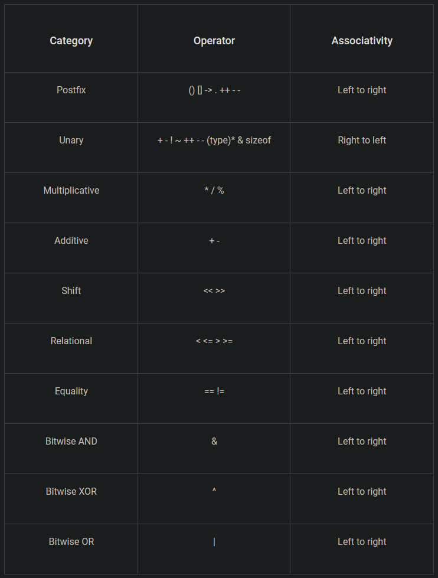

## Input Output Devices

- allows human or system to interface with computer
- can take input or give output
- KEYBOARD
- MOUSE
- JOYSTICK
- LIGHTPEN
- SCANNER
- WEBCAM
- MONITER
- PRINTER
- SPEAKERS

## Types of language

1. Machine Language
   - easier for comp, harder for us
   - lang of comps - bits

2. Assembly language
   - easier to understand than machine lang for us
   - numbers and eng letters used
   - deals with registers and bits
   - before running, assembled by assembler (convert ot 0 and 1)

3. high level lang
   - many eng terms
   - built in helpers (loops, if-else statements)

## C low level or high level

It's completely context dependent.

Compared to PHP, C is low level;
Compared to x86 assembly, C is high level;
Compared to the instructions I used to construct this universe in which you reside, C is so high level you can barely see it.

relative to who you compare it to or ask
So, in practice, you're likely to hear C being deemed "low level" unless you're talking to someone who fiddles bits in registers with a soldering iron for a living.

## C and history

- early 1970s - Dennis M. Ritchie at AT&T Bell Laboratories
- designed as minimalistic lang _ used to write OS for minicomputers
- Based on B programming lang. (Kane Thompson (1969-70) colleague of Ritchie)
- Rich rewrote and restored features from B to create C.
- wrote UNIX in C
- in 1980s, standarised by ANSI (Americal National Standards Institute)
- Also known as ANSI Standard C
- Very popular even now.
- C++ and Java (descendents)
- Latest C17

## Identifiers

- "Identifiers" or "symbols" are the names you supply for variables, types, functions, and labels in your program.
- Identifier names must differ in spelling and case from any keywords.
- You cannot use keywords (either C or Microsoft) as identifiers; they are reserved for special use.
- You create an identifier by specifying it in the declaration of a variable, type, or function.

## Character set

- set of alphabets, letters and some special characters that are valid in C language.

## Keywords

- predefined, reserved words used in programming that have special meanings to the compiler

## Variables

- containers for storing data values.
type varName = value;
format specifiers

## Tokens

- smallest unit in C
- every single thing is a token
- types
  - Here are the categories in which we can divide the token in C language:

    Identifiers in C  
    Keywords in C  
    Operators in C  
    Strings in C  
    Special Characters in C  
    Constant in C  
- Special char: (), ",", [], {}, *, &, #, .

int* x = pointer  
&var = gets mem address  
*var = gets value at mem address  

## Operators

- used to perform operations on variables and values.
- Arithmatic: `+ - * / %`
- Increment/Decrement: `-- ++` pre and post
- Assignment: `= -= += *= /= %= <<= >>= &= ^= |=`
- Relational: `== > < != >= <=`
- Logical: `&& || !`
- Bitwise: `& | ^ ~  >> <<`
-   

## Storage class

- defines scope of vars/funcs in C
- preced the type they modify

1. auto
   - default for local vars
   - only used inside funcs .i.e., local vars

2. registers
   - define local variables that should be stored in a register instead of RAM
   - limited to register size (usually 1 word)
   - mainly used for counters

3. static
   - instructs the compiler to keep a local variable in existence during the life-time of the program instead of creating and destroying it each time it comes into and goes out of scope
   - maintain value b/w func. calls

4. extern
   - used to give a reference of a global variable that is visible to ALL the program files
   - cant be initialized
   - used to declare global var or fun in ANOTHER FILE
