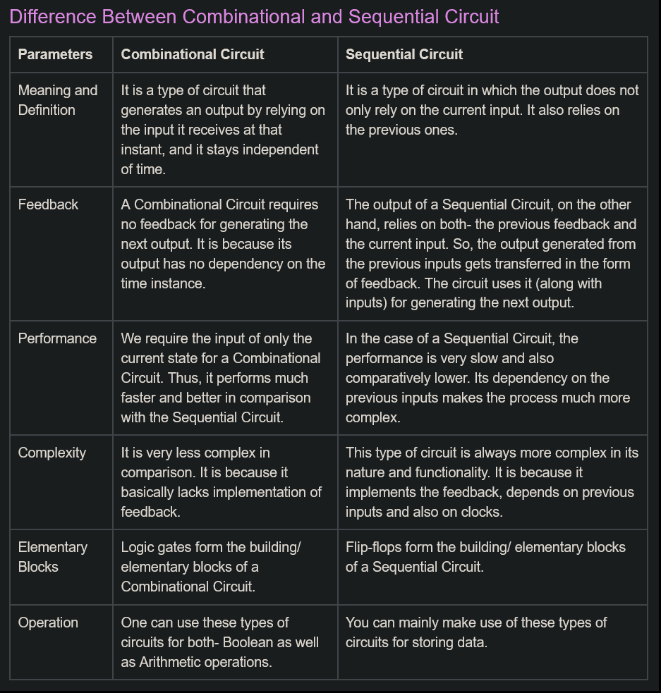
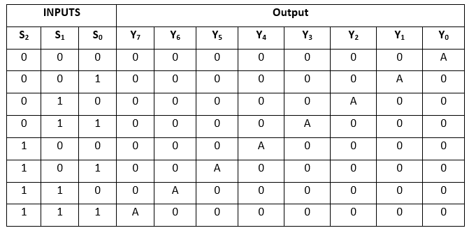

## BCD

Binary Coded Decimals

Complements

## Complements

- Used in digital computers _ simplifying subtraction operation and for logical manipulation.

__2 Types__ -

### r's complement

- If N is a no. to base r with integer part of n digit, the r's complement of N is defined as :  
$r^{n} - N$  
, where r = base of no.  
n= no. of integer digits  
N = given (+)ve no.

<b>WRITE SOME EXAMPLES HERE</b>

### (r - 1)'s complement

- If N is a no. to base r with integer part of n digit and m fraction digits, the (r-1)'s complement of N is defined as :  
$(r^{n} - 1) - N$   OR   $(r^{n} - r^{-m}) - N$  
, where r = base of no.  
n= no. of integer digits  
N = given (+)ve no.  
m = fraction digits

<b>WRITE SOME EXAMPLES HERE</b>

- Basically whatevers closest to $r^{n}$.

### Some stuff here

- There are two complement forms used in digital systems to represent signed numbers. These are 1's complement and 2's complement.
- These two forms are used to represent negative numbers.
- Most computer performs subtraction by 2's complement method.
- The advantage of performing subtraction by complement method is reduction in hardware instead of having separate digital circuits for addition and subtraction.
- Only adding circuits are needed, i.e., subtraction is also performed by adders only.

### 1's complement

- To calculate 1's complement of binary no., simply change all 1's to 0 and all 0's to 1.

### 2's complement

- Can be obtained by adding 1 to the 1's compelement of number.

Booth's multiplication algorithm

### Booth's multiplication algorithm

- Booth's multiplication algorithm provides steps to perform multiplication using binary number.
- Using this algorithm there will be no need to convert sign of final result if sign of multiplier and multiplicant is different.

### Subtraction using r's complement

To subtract two positive base r numbers with minuend (M) and subtrahend (N), follow steps-  

M - N

1. Equate number of digits between minuend and subtrahend. If they are not equal, padding of zeros is used to make them equal.
2. Find the r's complement of subtrahend
3. Add minuend with r's complement of subtrahend.
    1. If sum produces a carry, discard it
    2. If the sum doesn't produces an end carry, take the r's complement of sum and place a negative sign in front.

### Subraction using (r - 1)'s complement

1. Equate number of digits between minuend and subtrahend. If they are not equal, padding of zeros is used to make them equal.
2. Find the (r - 1)'s complement of subtrahend.
3. Add minuend with (r - 1)'s complement of subtrahend.
    1. If sum produces a carry, __ADD THIS CARRY TO LSB OF SUM__.
    2. If the sum doesn't produces an end carry, take the __(r-1)'s__ complement of sum and place a negative sign in front.

### Logic Gates

- Basic Building blocks of digital electronics.
- Used to prcess binary info.
- Applications:
  - Designing of various logic circuits.

## De Morgan's Theorem

1. $(A+B)^{'} = A^{'}.\ B^{'}$
2. $(A.B)^{'} = A^{'}+B^{'}$

## K-map

- k-map method is a graphicla tech. fro simplifying boolean func.
- Is is a 2d representation of truth table.
- provides a simpler method for minimising boolean expressions.
- k-map for n vars. is made up of $2^{n}$ squares. Each square estimates a product turn of a boolean expresssion.

## Combinational vs sequential

  

## Half adder

- Combinational circuit _ used to add 2 binary bits.
- 2 inputs and 2 outputs (Sum and Carry).
- sum = xor
- carry = and

## Full adder

- Combinational circuit _ used to add 3 binary bits.
- 3 inputs, 2 outputs (sum and carry)
- sum = A'B'C + AB'C' + A'BC' + ABC
- carry = AB + BC + AC

## Decoder

- combinational circuit _ has n inputs and $2^{n}$ outputs.
- receives n input signals and converts them into $2^{n}$ output signals.
- enabler
- 3x2 decoder with help of 2x4 decoders. (2 2x4 decoders and 1 invertor)

## Encoder SPECIAL

- combinational circuit _ has $2^{n}$ inputs and n outputs.
- receives $2^{n}$ input signals and converts them into n output signals.
- enabler NOT NEEDED.
- 3x2 decoder with help of 2x4 decoders. (2 2x4 decoders and 1 invertor)
- x = I4 + I5 + I6 + I7 (check which is 1 in input and add them).

## Multiplexer (data selector OR many to one device)

- combinational circuit _ has $2^{n}$ inputs and 1 output and n selection lines.
- receives $2^{n}$ input signals and converts them into n output signals.
- selects 1 ouput line out of $2^{n}$ input signals using n selection lines.

## Demultiplexer

- Same shit
-    

## Sequetial circuits

- out not only depend on current but previous too.
- ARE:
  - flips flops
  - registers
  - counters ???? more info