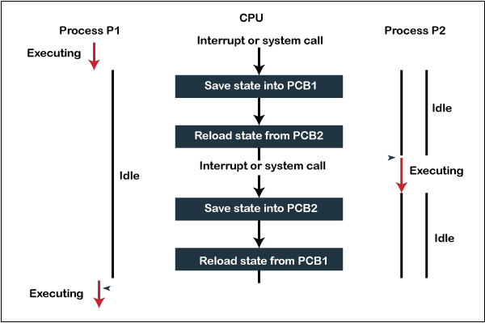

## 1. Write your view points in justification of the statement "Operating system is the core of a computer system and is also known as a resource manager"

Operating system is system software that manages a computer's hardware.
It provides application programs and is an interface over the hardware that let's user interact with the hardware with ease.

It is a core of operating system because of the many functionalities it provides to the user

### Convenience

- OS provides a convenient access to hardware to the user without the user needing to know how the hardware actually works.

### Efficiency

- Modern OS provides high throughput, because of which utilisation of computer hardware is maximized.

### Resource management

- Computer has a lot of resources such as, input output devices, file storage space, CPU, memory, etc.

<h2>OS role as a resource manager can be seen:</h2>

### Process management

- OS helps allocated resources to a process such as CPU time memory, access to input output devices etc.
- It also schedules processes according to its scheduling algorithm.

### Memory management

- When program executes, its loaded into memory. It access instructions and data from memory. After program execution is finished, memory is declared available and made available.
- OS keeps track of memory allocated to which process and how much.
- Which data to load and backup and when.
- Allocating and deallocating memory as needed.

### Storage system management

- Creating and deleting files / directories.
- Writing data securely into storage.
- Disc scheduling.
- Caching.

## 2. Write an explain key functions performed by kernel and shell of the operating system

<h2>Functions of kernel-</h2>

### Scheduling processes

- Allocates resources to processes, i.e., CPU time, memory, access to IO devices, etc.
- Schedules processes according to scheduling algorithm.

### Device management

- Manage devices such as IO devices, storage devices, network devices, etc.
- Manages information going to and from these devices.

### System calls

- Provides system calls to interact with hardware to the user.

### Interrupt handling

- When higher priority task comes, it executes and the current lower priority task is interrupted.

### Memory management

- Process when created and executed, occupies some memory. After finishing, the memory is released.

<h2>Functions of shell</h2>

- Interface that allows user to communicate with kernel.
- Provides protection to kernel from malicious users /code.
- Provides programming construct- variables, logical operators, looping and conditional statements, data structures, etc.
- Shell scripting to interact with system.
- Known as command interpreter- accepts a command, inteprets it, executes it, then waits for another command.

## 3. how does system call work?

### Working of system call

- When process is under execution under user mode (on behalf of user), and requires some privileged OS resources to complete, process makes a system call.
- System call is executed in kernel mode on a priority basis.
- When system call completes, control is passed to process in user mode.
- The process continuous execution in user mode.

  

## 4. Explain key characteristics of following types of OS

### Batch processing OS

- Uniprocessing OS where similar jobs are batched together using some criteria.
- These jobs are loaded one after another.
- When one job finishes, memory is released and the next job in queue executes.

### Multiprogramming OS

- Run multiple programs on a single processor system.
- If running process requires IO and is currently using CPU then the next process is given the CPU and so on.
- Not all processes run simultaneously though.
- Goal is to have better efficiency, less CPU idle time and higher throughput.

### Multitasking OS

- Run more than one computer tasks at a time.
- OS keeps track where you are in these tasks and switch between tasks without losing data.
- Decides how much time one task spends before assigning another task to use OS.

### Real time OS

- OS for real time applications that processes data and events that have defined time constraints.
- All processing must occur within defined constraints.

### Multiprocessor OS

- Parallel computing (system can use more than one processors).

#### 1. Symmetric multi processing OS

- Each processor executes same copy of OS, and have a shared memory.
- New jobs can be assigned to less burdenned CPU.
- "Shared everything" as memory and IO devices are shared.
- No master / slave processor relationship.

#### 2. Asymmetric multiprocessing OS

- Master / slave relationship between processor.
- A master processor controls activities of other processors.
- Master processor is selected by OS and that processor then managers resources for the job it was selected for.

### Parallel processing OS

- Task divided into subparts and these subparts are executed by multiprocessors/Threads simultaneously.
- The result is merged and thus the task finishes.
- Completes job in fastest possible time .

### Distributed OS -

- Multiple system connected through single communication channel .
- These systems have their individual processes and memory .
- All these systems connecting through a single channel are considered as a single unit .
- Allows user to continue working even if individual S/W OR H/W fails .

## 5. Analyse and compare Monolithic and microkernel

### Monolithic kernel

- Monolithic kernel is a single large process running entirely in a single address space.
- Single static binary file for the stop
- All kernel services exist and execute in the kernel address space.
- It can invoke functions directly .
- Example- Linux , bsd, Unix , Solaris .

### Micro kernel

- Kernel is broken down into separate processes, known as servers . Some run in kernel space and some run in user space.
- All servers run in different address spaces.
- Invokes "services from each other by sending messages via IPC (Inter Process Communication) .
- Example- Minix, Mach, Hurd, QNX, AmigaOS.

  

## 6. Describe hard and soft booting of an operating system . Also explore and analyse the Linux booting process

### Hard (Cold) booting

- When computer starts for first time or from a shutdown state.
- System read all instructions from the ROM BIOS .
- OS is loaded fully from scratch to the main memory .

### Warm (Hot) boot

- Happens when system doesn't respond , and system restarts .
- System just restarts , not reloaded completely.
- It restarts while power is still on .

### Linux Booting Process

6 Steps

1. BIOS

   - Basic Input/Output System
   - Performs some system integrity checks
   - Searches, loads, and executes the boot loader program.
   - Once the boot loader program is detected and loaded into the memory, BIOS gives the control to it.  
   - tldr BIOS loads and executes the MBR boot loader.

2. MBR

   - Master Boot Record.
   - It is located in the 1st sector of the bootable disk. Typically /dev/hda, or /dev/sda
   MBR is less than 512 bytes in size.
   - This has three components
      1) primary boot loader info in 1st 446 bytes
      2) partition table info in next 64 bytes
      3) mbr validation check in last 2 bytes.
   - Contains info about GRUB (or LILO in old systems).
   - tldr MBR loads and executes the GRUB boot loader.

3. GRUB

   - Grand Unified Bootloader.
   - If you have multiple kernel images installed on your system, you can choose which one to be executed.
   - GRUB has the knowledge of the filesystem (the older Linux loader LILO didn’t understand filesystem).
   - tldr GRUB just loads and executes Kernel and initrd images.

4. Kernel

   - Mounts the root file system.
   - Kernel executes the /sbin/init program
   - Since init was the 1st program to be executed by Linux Kernel, it has the process id (PID) of 1. Do a ‘ps -ef | grep init’ and check the pid.
   - initrd stands for Initial RAM Disk.
   - initrd is used by kernel as temporary root file system until kernel is booted and the real root file system is mounted.

5. Init

   - Looks at the /etc/inittab file to decide the Linux run level.
   Following are the available run levels
       - 0 – halt
       - 1 – Single user mode
       - 2 – Multiuser, without NFS
       - 3 – Full multiuser mode
       - 4 – unused
       - 5 – X11
       - 6 – reboot

6. Runlevel programs

   - Depending on your default init level setting, the system will execute the programs from one of the following directories.

      - Run level 0 – /etc/rc.d/rc0.d/
      - Run level 1 – /etc/rc.d/rc1.d/
      - Run level 2 – /etc/rc.d/rc2.d/
      - Run level 3 – /etc/rc.d/rc3.d/
      - Run level 4 – /etc/rc.d/rc4.d/
      - Run level 5 – /etc/rc.d/rc5.d/
      - Run level 6 – /etc/rc.d/rc6.d/

   - Under the /etc/rc.d/rc*.d/ directories, you would see programs that start with S and K.
   - Programs starts with S are used during startup. S for startup. Programs starts with K are used during shutdown. K for kill.

## 7. Define process , process control block PCB and context switching

#### Process

- Program is finite set of instructions written in a particular programming language for performing particular task .
- A program during execution is called a process .
- A process has information about it stored in PCB , i.e., program counter , registers etc .
- Each process has a PID used to identify.

#### Process control block (PCB)

- PCB is a data structure that contains information of the process related to it .

#### Structure of PCB

  

#### Process state

- Specifies process state, i.e., new, ready, running, waiting, terminated .

#### Process number

- Shows the number of particular process .

#### Program counter

- Contains address of next instruction that needs to be executed in process .

#### Registers

- Specifies registers used by process, i.e., accumulators , index registers, stack pointers , etc .

#### Memory limits

- Info about memory management system used by OS . (page tables , segment tables)

#### Open file list

- Info about list of files opened for a process .

### Context switching

- Technique used by OS to switch a process from one state to another .

Steps taken when switching process P1 to process P2:

- Context switching save the state of P1 in form of program counter and registers to PCB .
- Update PCB of P1 and move P1 to appropriate queue .
- New process P2 is selected from a queue to execute.
- Update PCB of P2 appropriately.
- Resume P2 or executed it from start depending on the info in PCB of P2.

  