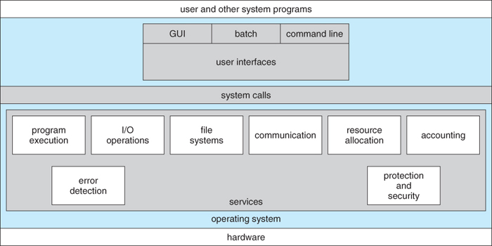
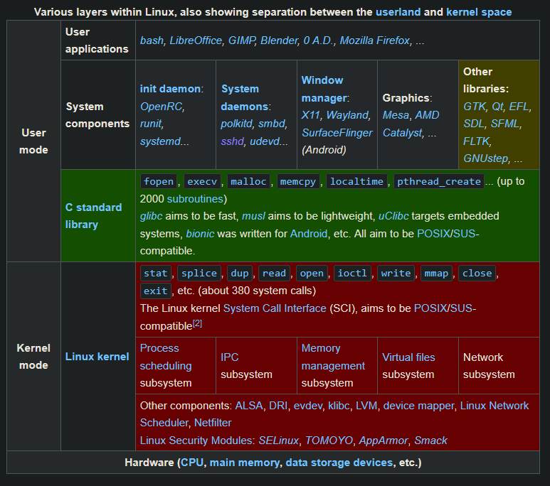
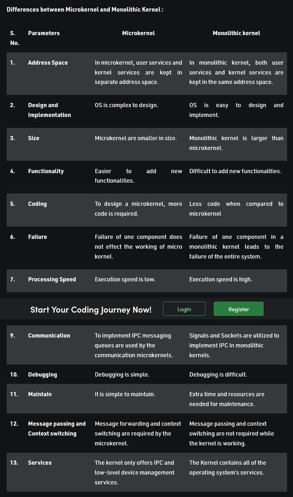
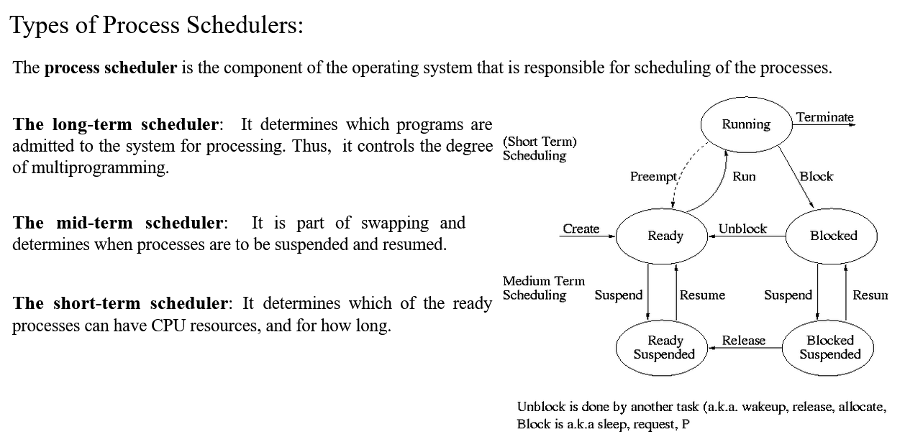
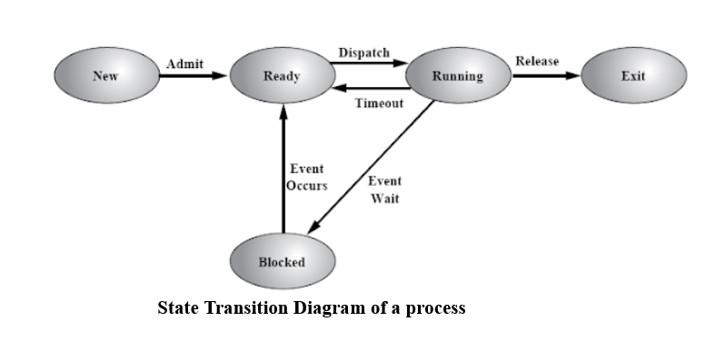

# OS

- System S/W _ controls execution of app. programs and acts as an interface b/w user and H/W.

# Its functions

- Convenience:
- Efficiency:
- Ability to evolve: effective development and upgrades.
- Throughput: maximize throughput(number of tasks per unit time).

# Functionalities (need some improvement)

- Resource Management:
  - Everything is resource. Maximize efficiency and decrease load on system.
- Process Management:
  - Scheduling, termination of process.
- Storage Management:
  - Keeping track of data on disk.
- Memory Management:
- Security and protection

# OS structure

1. Kernel:
   - Os core _ controls all tasks of system.

2. Shell/Interface:
   - interface _ allow users to communicate with kernel.

3. Utilities/App. program

## Shell

- Program _ interface to user to use OS services
- Functionalities:
  - Provides interface.
  - Protection (kernel from dumb users/programs)
  - Programming constructs (Shell scripting) (vars, loops, ops, conitionals)

## Kernel

- Core _ provides essential services for all other parts.
- Main layer b/w OS and H/W
- Manages applications and H/W devices.
- Main functionalities:
  - Scheduling and management.
  - To establish communication between user level application and hardware.
  - To decide state of incoming processes.
  - To control disk management.
  - To control memory management.
  - To control task management.

## Kernel space vs User space

- KS reserved for privilifed OS functions.
- US runs app. S/W.

## Microkernel and Monolithic Kernels

Eg:

- Micro: Mach, Minix, Hurd, QNX, AmigaOS
- Mono: Linux, OS X, Unix.

\
\
\
\
\
\
\
\
\

## Process Scheduling

- Control execution of processes
- 2 Main objectives
  1. keep CPU busy all time
  2. better response rate

4 Circumstances

1. CPU switches from RUNNING -> WAITING state
2. CPU switches from RUNNING -> READY state (interupption occurs)
3. CPU switches from WAITING -> READY state (I/O complete)
4. process terminated

  

  

## State transition diagram of process

1. New

- program loaded into main mem.

2. Ready

- after getting created, process goes into ready state (waiting for CPU). OS then picks them up.
- process waits for CPU and reside in main memory

3. Running

- OS choose process from ready queue (acc. to scheduling algo)

4. Blocked/Wait

- if preempted or I/O

5. Terminated

- after finishing execution
- PCB wiped

6. Suspend ready

- proc. in ready state _ moved to second. mem from main due to lack of resources
- if main full, and higher priority proc comes, some proc shifted to sec. mem.

7. Suspend wait

- proc. in waiting state _ waiting for some resources, and if wait might as well wait in sec. mem. lol

## Premptive

- limited CPU cycles
- interrupted
- flexible
- better CPU utilization
- less waiting time
- less response time

## Scheduling algo only used when >2 proc

## IMP lul

- CPU utilization
  - $sum\ of\ individual\ CPU\ usage\ /\ total\ time\ *\ 100\%$
- throughput
  - $no.\ of\ proc\ /\ total\ time$
- TAT
  - TAT P(1) = Compl. time - Arrival time
  - then find avrg. of all (ALL TAT / no. of proc)
- Waiting time
  - TAT - (CPU burst + IO burst)
  - find avrg similiarly

## FCFS

- non pre
- cpu scheduling algo
- meaning....
- proc. arranged for exec. acc. to arrival time
- meaning....
- if same time, randomness

## SJF

- non pre
- cpu scheduling algo
- meaning....
- proc. arranged for exec. acc. to CPU burst/job length
- meaning....

## SRTN

- pre
- cpu scheduling algo
- meaning....
- proc. arranged for exec. acc. to CPU burst/job length
- meaning....
- BASICALLY PRE SJF
- IF SAME TIME, CURRENT CONTINUE

## Round Robin

- pre
- cpu scheduling algo
- meaning....
- suitable for highly interactive sys.
- time quanta stuff
- if quanta finished but proc doesnt, proc. send to end of ready queue. Quanta then given to next in line.
- IF CLASH, NEW PREFERRED.

## MLFQ

- pre
- cpu scheduling algo
- meaning....
- proc assigned to queue and can move in between them.
- MULTIPLE LEVELS OF READY QUEUE
