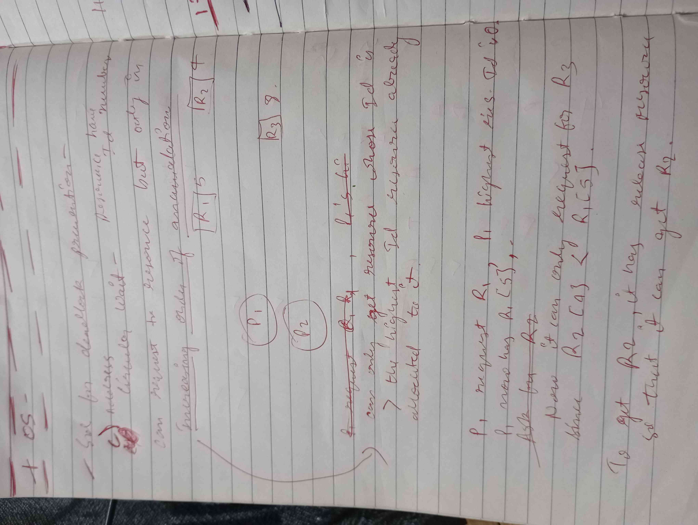

# Process Syncronization

## IPC

- mechanism _ allows proc. to communicate with each other, sync their actions.
- imp. for OS, same as above but different wording.
- Actual mechanisms used for IPC:
  - Shared Mem: mem _ shared by multi. proc., used to r/w from it.
  - Pipes: unidirectional channel _ send info to other proc., only from simple proc (not complex).
  - Message Passing: same as pipes but multidir. and for complex proc., more flexible (for distributed sys.).
  - Sockets: endpoint _ send/receive data across comp. network., can be used for comm. b/w same machine or diff.
  - RPC: (Remote Procedure Calls) a proc. can invoke procedure on another proc. as if it was local procedure. very flexible and heavily used in distributed sys.

## Cooperating and Independent proc

- Coop:
  - work together _ achieve same goal.
  - comm. with each other, share res. to complete task.
  - in distributed sys.
- Ind:
  - not rely on other.
  - can run concurrently with other BUT dont need to coordinate with others.
  - in single threaded program

## process synchronization

- what:
  - coordination of processes _ so that >= 2 concurrent processes don't simultaneously execute certain parts of their programs which could lead to race conditions and other undesirable outcomes.
- why:
  - 2nd part of what.
  - Without proper sync. , multiple processes may try to access the same resource simultaneously
  - race condition _ uncertain outcome, incorrect behaviour, data corruption.
- when:
  - same as before
  - used in multi-threaded programs, multi-process programs, distributed systems
- how:
  - semaphores, mutexes, monitors, and message passing

## Bad proc. sync. leads to

- Race Condition
- Deadlocks
- Priority Inversion (WAS MENTIONED IN THE BOOK, WRITE IN EXAM TO IMPRESS):
  - high-priority process is blocked by a low-priority process that is holding a resource that the high-priority process needs
  - delays exec of high prior. proc., very problematic in real time OS.

## Race Condition

- Basically the WHY of proc. sync.
- \>=2 proc. try to access the same resource simultaneously, leading to unpredictable behaviour and data corruption.
- Race conditions may be difficult to detect and debug, and can occur under specific circumstances.
- Proper synchronization techniques, such as semaphores, mutexes, and monitors, can prevent race conditions by allowing processes to coordinate their access to shared resources.

## Critical Section (CS)

- wat:
  - part of prog. _ accesses a shared res., needs to be executed without interference from other proc.
- y:
  - protect shared resources from concurrent access
- wen:
  - multithreaded programs
- how:
  - semaphores

## Critical Section Problem

- wat:
  - synchronization problem _ when multiple proc. need to access shared res. concurrently.
- y:
  - necessary to solve so that concurrent proc. works (therefore not inconsistent result)
- wen:
  - same as wat
- how:
  - semaphores

- Conditions for Solution of CSP (must satisfy):
  - Mutual exclusion:
    - At most one process or thread can be in its critical section at any given time.
  - Progress:
    - if no proc. exec. CS, and some proc. wants to go do CS, then selection of next proc. to do CS can't be postponed indefinitely.
  - Bounded waiting:
    - bound exists on no. of times. other proc. allowed to enter THEIR CS after a proc. made req. to enter its CS and BEFORE THAT REQ GRANTED.
-

## Peterson Solution

  ```c
  int turn;
  boolean flag[2];
  while (true) {
    flag[i] = true;
    turn = j;
    while (flag[j] && turn == j)
    ;
    /* critical section */
    flag[i] = false;
    /*remainder section */
  }
  ```

- All three conditions are preserved.

## Bakery Algorithm

- assigning a unique ticket to each thread that wants to enter the CS. When a thread wants to enter the critical section, it takes a ticket and waits until its turn arrives. The turn of a thread is determined by the value of its ticket and the tickets of the other threads. The thread with the lowest ticket value gets to enter the critical section first, followed by the thread with the next lowest ticket value, and so on.
- The bakery algorithm ensures mutual exclusion by requiring each thread to check the tickets of the other threads before entering the critical section. If a thread finds that it has the lowest ticket value, it can enter the critical section. If not, it must wait until its turn arrives. This ensures that at most one thread can be in the critical section at any given time.
- Progress: The bakery algorithm ensures progress by allowing each thread to eventually enter the critical section once it has taken a ticket. If a thread is blocked waiting for its turn to arrive, it will eventually enter the critical section once all the other threads with lower ticket values have finished their critical sections. This ensures that the system makes progress and that no thread is blocked indefinitely.
- Bounded waiting: The bakery algorithm also ensures bounded waiting by assigning unique ticket values to each thread. Since the tickets are assigned sequentially, the waiting time of a thread is bounded by the number of threads that have entered the critical section before it. For example, if a thread has the 10th lowest ticket value, it will wait at most 9 critical sections before its turn arrives. This ensures that the waiting time of each thread is bounded and that the system does not suffer from long delays.

## Semaphores (Binary and Counting)

- wat:
  - synchronization objects _ control access to shared res.
  - They are typically implemented using a counter and a queue of waiting
    threads.
- y:
  - ensure correctness, integrity of shared data.
- wen:
  - multithreaded
- how:
  - wait and signal

      ```c
      wait(semaphore *S) {
           S->value--;
          if (S->value < 0) {
            add this process to S->list;
            sleep();
          }
      }
      ```

      ```c
      signal(semaphore *S) {
        S->value++;
        if (S->value <= 0) {
          remove a process P from S->list;
          wakeup(P);
        }
      }
      ```

  - sleep() suspends proc. that calls it
  - wakeup() resumes the suspended proc.

## Producer and Consumer Problem

- wat:
  - is a classic example of a synchronization problem in which a producer
    process produces a resource, and a consumer process consumes the
    resource. The producer and consumer processes must be synchronized to
    ensure that the producer does not produce more resources than the
    consumer can consume, and that the consumer does not consume resources
    that have not been produced yet.
- how:
  - One solution to the producer-consumer problem is to use semaphores to synchronize the producer and consumer processes.
  - write about semaphore here idk

      ```c
      wait(S){
        while(S<=0);   // busy waiting
        S--;
      }

      signal(S){
        S++;
      }
      ```

      ```c
      // INITIAL SETUP
      mutex = 1
      Full = 0 // Initially, all slots are empty. Thus full slots are 0
      Empty = n // All slots are empty initially
      ```

  - FOR PRODUCER:

      ```c
      do{
         //produce an item

         wait(empty);
         wait(mutex);

        //place in buffer

        signal(mutex);
        signal(full);

       } while(true)

      ```

  - FOR CONSUMER:
  
      ```c
      do{
          wait(full);
          wait(mutex);
          
          // consume item from buffer

          signal(mutex);
          signal(empty);

      } while(true)

      ```

    - EXPLANATION:
      - producer produce item, wait(empty) will decrease empty by 1. acquire mutex.
      - item placed in buffer, mutex release, signal(full) increase value by 1.
      - yada yada yada.

- mutexes, semaphores, and monitors are all synchronization objects that
  are used to control access to shared resources in a concurrent system.
  However, they differ in their implementation and use cases. Mutexes are
  used to ensure that only one thread or process can access a shared
  resource at a time, semaphores are used to allow multiple threads or
  processes to access a shared resource depending on the value of the
  semaphore, and monitors are used to provide a mechanism for threads or
  processes to wait for a condition to be met before continuing.

## Deadlock

- wat:
  - situation where >= 2 proc. are blocked and unable to make progress, cause waiting for a res. held by another proc.
- y:
  - when proc need multiple res. in specific order, and they not in that order available.
- wen:
  - usually in sys. where large no. of proc.

## Conditions for Deadlock to occur

- ME:
  - at least 1 res. involved in deadlock MUST BE non-shareable.
- Hold & Wait:
  - def. of deadlock.
- No preemption:
  - res. cant be taken from proc. while its using it.
  - res. must be held until released.
- Circular Wait:
  - must be cycle of res. DEPENDENCY.
  - extension of H&W cond.

## Methods for handling it

  1. ignore problem and pretend it never occurs.
  2. prevent or/ avoid
  3. allow sys. to enter deadlocked state, detect it, and recover.

### Ignore Problem

- Most used (lin, win).
- upto kernel and app. devs. to handle deadlocks.

### Prevention (has how device utilization and throughput)

- dont let any one of 4 cond. hold true
- ME:
  - very shit.
  - some res. are non-shareable by nature.
- Hold & Wait:
  - Case1:
    - ask P1 for all res. needed, and just give it all.
    - y shit? IMPRACTICAL
  - Case2:
    - proc. only req. res. when it has none. (when want one, has to discard all of its own)
    - y shit? starvation will happen
- No preemption:
  - if req. res. not avail., preempt all res. already held by it.
  - these res. are added to list of res. proc. is waiting for.
  - proc. only restart when it gains all prev. res. back and new ones.
  - HOLY SHIT!! THIS IS SO SHIT LULE.
- Circular Wait:
  - prob. best (still shit though)
  - proc. req. res. in INCREASING ORDER OF ENUMERATION.
  - 

### Avoidance

- require additional info about how res. are to be requested.

#### RAG (only for res. that have 1 instance)

#### Banker's Algo

- proc must declare how many need of res. instance.
- whats needed:
  - available
  - max (proc needs)
  - allocated
  - need (max - allocated)
- Safety algorithm (just watch this video man)
  - <https://www.youtube.com/watch?v=0iSh3Dwn4fo>
- Resource allocation algo.

  1. if req <= need
  2. if req <= avail
  3.

    ```c
    void temp_allocation() {
          allocated += req
          need -= req
          avail -= req
        }
    ```

  4. check if safe (safety algo)
  5. if 4. safe, res. allocated.

### Detection and Recvery

1. periodically runs deadlock detection algorithm, to check if deadlocks.
2. if deadlock, then find which proc
3. algo selects proc. to be killed or rolled back, based on a predetermined criterion.
4. actually does it, releasing the resources it was holding.
5. remaining proc. can continue exec., since res. now avail.
