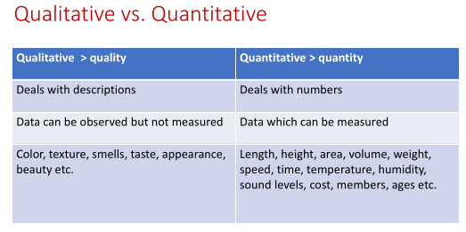

# Introduction to Statistics: Population, Sample, Data

## Statistics

- Mathematical Science
- collect, summarize, interpret, and make conclusion on the data.

- Formal definition - It’s a study of collecting organizing and summarizing and
presenting data .

## Statistic

- Numerical Quantity, calculated in sample to estimate in population.

## Population

- Universal set of all objects under study.
- Compelete set

## Sample Set

- No. of observations used for calculating estimates of a given population.

## Types of data

1. Primary Data:
   - Data collected specially for pupose in mind.
   - First time from original source.
   - Eg - Survey.
2. Secondary Data:
   - Reused data, collected from primary data.
   - Eg- Data from book.
3. Qualitative Data (categorical data):
    - Measures quality or characteristics.
    - Eg - Hair Color, Gender.
4. Quantitative Data:
   - Measures numerical value.
   - Eg - Height, Age, etc.

   1. Discrete Data:
      Only specific value (usually whole nos.)

      eg- Rolling dice, no of questions in exam. 
   2. Continuous Data:
      Value form an interval.

      Eg- Temperature, speed of car, body weight.

# Statistical Concepts: Variables, Branch of Statistics, Univariate, Bivariate and Multivariate data, Sampling

## Variables
- Traits/Characteristics _ change value _ case to case.
- Causal relationship.
1. Independent Variable: Can be controlled.
2. Dependent Variable: Dependent on indep. var.

## Branch of statistics
1. Descriptive Statistics:
   - tools used to summarize _ purpose of easier interpretation. 
   - Graphs are used here.

2. Inferential Statistics:
   - using sample data _ make conclusion about population.

## Univariate, Bivariate and Multivariate data and its Analysis

### Univariate Data:
- Only 1 var.
- No causal releationship.

### Bivariate Data:
- Relationship b/w 2 vars.
- Eg: Temp and sales of ice cream, weather and traffic accidents.

### Multivariate Analysis (>3 vars):
- An advertiser wants to compare the popularity of four advertisement on a website,
then their click rates could be measured for both men and women and relation
between variable can be examined.

## Sampling
- Process _ taking sample _ population.

1. Probablity Sampling
   - Each member of pop has equal chance of being selected, randoness is element of control.
2. Non-probabilty Sampling
   - Based on biased/personal judgement.

Types
1. Probabiltiy Sampling
   1. Simple random sampling:
      - All members same chance of being selected.
   2. Systematic Sampling:
      - equal difference b/w members.
   3. Stratified Sampling:
      - members divided based on some traits into groups and then selected from these groups.
   4. Cluster Sampling (Area Sampling):
      - select sampling units randomly, then study all members of all seleted units.
2. Non-probability sampling
   1. Purposive/Judgemental:
      - select "typical group" who might represent larger pop, then collect data from that group.
   2. Convenience Sample:
      - select member _ conveniently available.
   3. Quota Sampling:
      - select members based on quota
   4. Snoball Sampling (Chain, Chain referral, Referral sampling):
      - select a member based on some criteria, after data from subject, ask for referral of similiar individuals who also meet criteria.

# Data Levels of Measurement, Summary Statistics

## Data Levels of Measurement

4 levels of measurements

1. Nominal (Non-Numeric)
   - Numbers used only to classify data.
   - Words, letters, alphanumeric used.
   - Eg: Jersey number, Male/Female as M/F.

2. Ordinal
   - Order matters but difference doesn't.
   - Eg: Order of winning a race.

3. Interval
   - Order, diff matter but not ratio.
   - Eg: temp b/w 34-40 and 50-56.

4. Ratio

   - All matters.
   - Eg: no of student in class, no of patients seen by doctor.

## Summary Statistics
- same definition as descriptive stats.

3 categories

1. Measure of location:

   - tells where data centered, or upward/downward trend.
   - Mean, median, mode.

