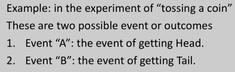
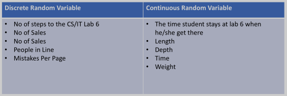
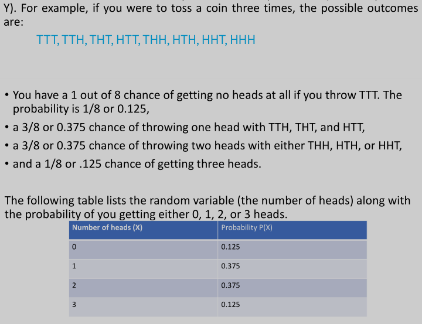

## Basic Probability Theory: Rules and Formulas

### Probability

- measure of the possibility _ an event will occur in random experiment
- value b/w 0 and 1
- 0: no chance of happening
- 1: definitely will happen
- <0 or >1 means miscalculation

### Trail

- any particular performance of a random experiment
- basically means random experiment
- each trail results in >=1 outcomes
- ex: tossing coin, tossing 4 coins, rolling die, etc.

### Random Experiment

- possibility of coming outcomes but not sure what is to come

### Event/Outcome

- something that results
- result caused by previous action
- these results are called events
- denoted by capital english letter (A,B,C...)
-   

### Sample Space

- set of all possible outcomes of random exp.
- denoted by S
- events: subset of sample space
- written withing curly braces

Example: Rolling die
S = {1, 2, 3, 4, 5, 6 }
Event A = {1, 3, 5}
Event B = {2, 4, 6}

## Basic Probability Theory: Rules and Formulas Part 2

### Probability Rules

- P(A) : pobability of A, A is event
- P(A|B) : probability of A given B occurs
- P(not A) : prob of not A
- or is Union U
- and is intersection ꓵ
- mutually exclusive events: events that CANT occur at same time
- disjoint outcomes: 2 outcomes disjoint, if they CANT occur at same time
- dependent event: whose outcome affected by another outcome

### Addition Rule

- If A and B NOT mutu. excl.
  - $P(A\ or\ B) = P(A) + P(B) - P(A\ and\ B)$
  - and means prob. of A and B both happening
- If A and B mutu. excl.
  - $P(A\ or\ B) = P(A) + P(B)$
  - 

- addition rule for disjoint outcome: same as mutu. excl.
- 

### Multiplication Rule

- if A and B dependent event
  - $P(A\ and\ B) = P(A) *P(B\ |\ A)\ \ \ \ OR\ \ \ \ P(B)* P(A\ |\ B)$
- if A and B independent event
  - $P(A\ and\ B) = P(A)\ *\ P(B)$

### Complement Rule

- $P(not\ A) = 1\ -\ P(A)$
- P(A) not P(not A) can never occur together

\
\
\
\
\
\
\

<h1>SOME EXAMPLES HERE</h1>

## Probability Distributions

### Probability Distro

#### Random Variable

- var that contains outcome of probability
- numerical value assumed

1. Discrete random var

- finite values, whole nums
- outcome represented by x, x is finite
- Ex. In an experiment which counts the number of customers entering a shop, the outcome can vary from 0 to n customer i.e. 0,1,2,3,4,5,…….,n

2. Continuous random var

- any value in given interval, fraction
- outcome represented by x, x is any value in interval
- Ex- In an experiment which counts the time taken to buy a good in minutes ie. 0, 1.5, 2.75, 3.2, ……, n

  

### Probability Distribution

- how prob. occur for different values of random var.
- prob. function f(x) or P(x)
- prob. function provides probab. of each value of random var.
- if x is discrete, P(x) is discrete
- if x is cont.....

#### Prob. Distro. Table

- links every outcome with prob. of even occuring
-   
- sum is always 1

### Binomial Distribution

- probability of a SUCCESS or FAILURE outcome in an experiment that is repeated multiple times.
- $b(x, n, P) = nCx\ *\ P^{x}\ *\ (1\ -\ P)^{(n\ -\ x)}$  
, $nCx = n! / x!(n – x)!$  
b = binomail prob.  
x = total no. of success  
P = prob. of success on INDIVIDUAL trial  
n = no. of trials  
\
\
\
\
\
\
\

<h1>SOME EXAMPLES HERE</h1>